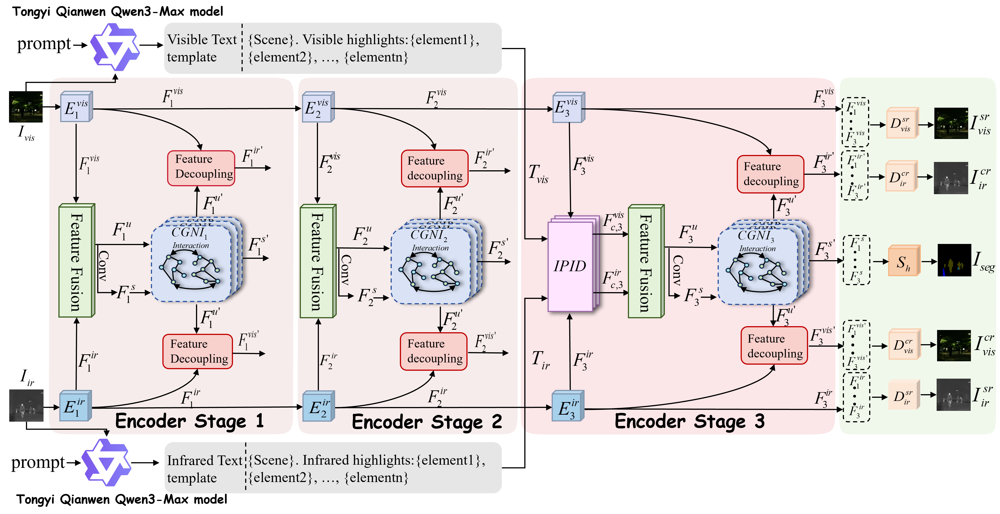

# DIGR

Official implementation of **DIGR: Dynamic Instruction-Aware Geometric Representation for Infrared-Visible Image Fusion**.

## 1. Introduction

DIGR is an infrared-visible image fusion framework that introduces instruction-aware semantic calibration and cross-graph semantic interaction. The model aims to generate fused images with salient infrared targets, rich visible textures, and improved downstream semantic segmentation performance.

## 2. Recommended Environment

The experiments are conducted with the following environment:

- Python 3.8.10
- PyTorch 2.0.0 + CUDA 11.8
- NumPy 1.24.2
- OpenCV 4.13.0
- SciPy 1.10.1
- Kornia 0.7.3
- scikit-learn 1.3.2
- Pillow 9.4.0
- Matplotlib 3.7.1
- tqdm 4.61.2
- Transformers 4.46.3

## 3. Framework



## 4. Dataset Preparation

We conduct experiments on three public infrared-visible image fusion datasets, including MFNet, Potsdam, and WHU. Please organize the dataset directories as follows:

```text
dataset/
├── train/
│   ├── mfnet/
│   │   ├── annotations/
│   │   │   └── train.json
│   │   ├── ir/
│   │   │   ├── input/
│   │   │   └── target/
│   │   ├── rgb/
│   │   │   ├── input/
│   │   │   └── target/
│   │   └── seg/
│   ├── Potsdam/
│   │   └── ...
│   └── WHU/
│       └── ...
└── test/
    ├── mfnet/
    │   ├── annotations/
    │   │   └── test.json
    │   ├── ir/
    │   │   ├── input/
    │   │   └── target/
    │   ├── rgb/
    │   │   ├── input/
    │   │   └── target/
    │   └── seg/
    ├── Potsdam/
    │   └── ...
    └── WHU/
        └── ...
```

Here, `ir/input` and `rgb/input` denote the input infrared and visible images, respectively. The `ir/target` and `rgb/target` folders are used for image reconstruction supervision. The `seg` folder contains semantic labels for downstream semantic guidance. The `annotations` folder contains the textual annotation files used for instruction-aware semantic calibration.

Before training or testing, please modify the dataset root path in the corresponding data loading files according to your local directory.

## 5. Text Annotation

DIGR uses textual annotations as instruction priors for semantic calibration. For each infrared-visible image pair, we generate a textual description with the following template:

```text
{scene}. Visible/Infrared highlights: {element 1}, {element 2}, ..., {element n}.
```

Here, `{scene}` denotes the scene-level description, and `{element 1}`, `{element 2}`, ..., `{element n}` denote the key visible or infrared elements in the image pair.

We use Tongyi Qianwen Qwen3-Max to assist in generating the textual annotations. These annotations are stored in the corresponding JSON files, for example:

```text
dataset/train/mfnet/annotations/train.json
dataset/test/mfnet/annotations/test.json
```

During training, we use the pre-trained CLIP text encoder to extract textual instruction features from the generated descriptions. Specifically, we adopt `openai/clip-vit-base-patch32` from Hugging Face. Please download the model in advance and place it under:

```text
./clip-vit-base-patch32
```

The model can be downloaded from:

```text
https://huggingface.co/openai/clip-vit-base-patch32
```

In our implementation, the CLIP tokenizer and text encoder are loaded locally with `local_files_only=True`. The CLIP text encoder is frozen during training, and the extracted global text feature is further projected to the channel dimension of each network stage through a text guidance adapter.

## 6. Training

Before training, please modify the dataset path, CLIP model path, batch size, learning rate, and other hyperparameters in the training script according to your local environment.

To train DIGR, run:

```bash
python train_fusion.py
```

The training process includes image reconstruction, image fusion, semantic guidance, and instruction-aware semantic calibration. The trained model checkpoints will be saved in the corresponding output directory.

